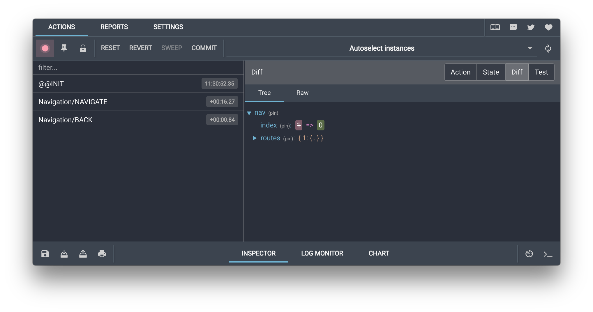

slidenumbers: true
slidecount: true
class: slide-separator


### Angular
# NgRx

---
## Premessa

Cos'è uno **stato**?
- La rappresentazione di un'applicazione in un preciso momento
- Un dato che può cambiare

```html
Value: {{ counter }}
<button (click)="increment()">Increment</button>
```
```ts
export class CounterComponent {
  
  // Stato
  counter: number = 0;
  
  // Azione
  increment() {
    this.counter = this.counter + 1;
  }
}
```

---
## Cos'è Redux

Redux è una libreria e un pattern per gestire e aggiornare lo stato applicativo, usando eventi chiamati azioni.  
Funge da contenitore centralizzato per lo stato che dev'essere usato in tutta l'applicazione, con delle regole per aggiornare lo stato in maniera predicibile.

#### _Redux in breve_
- Design pattern dal 2013, creato da _Dan Abramov_ e _Andrew Clark_
- Ispirato a FLUX, pensato per React
- Pensato per gestire lo _Stato Applicativo_
- Indipendente dal framework utilizzato

---
## Perché Redux?

- Le applicazioni diventano sempre più complesse
- Lo stato di un'applicazione è variegato
  - Stato della UI (popup, modali, form...)
  - Stato su server (entità, profilo utente...)
  - Stato del router (url corrente, parametri...)
  - ...
- Lo stato si perde fra molti componenti
- Lo stato, spesso, va condiviso fra varie parti dell'applicazione

---
## Quando usare Redux?

Redux è consigliato in questi scenari:
- Molti dati che servono in più punti dell'app
- Lo stato cambia frequentemente
- La logica per modificare lo stato è complessa
- L'applicazione è diventata complessa e il team si è ingrandito

---
## Redux: Unidirectional Data Flow


---
## Principi di Redux
- One-way data flow
- Single Source of Truth
- Immutabilità (lo stato è in sola lettura)
- Lo stato viene aggiornato solo da funzioni pure (reducer)

### NgRx
- Creato per Angular
- Basato sul pattern di Redux
- Basato sugli Observable
---
### @ngrx/store
- Tutti i benefici di Redux
  - Single Source of Truth
  - One-way data flow...
- Facilità di testing
- Performance
  - `@Input` immutabili
  - `ChangeDetectionStrategy.OnPush`
- Divisione degli stati
  - Root (stato principale)
  - Feature (stati lazy-loaded)
  
---
## State

```ts
interface Todo {
  id: string;
  text: string;
  completed: boolean;
}

interface TodoState {
  todos: Todo[];
  filter: 'ALL' | 'COMPLETED' | 'ACTIVE'
}
```

```ts
const initialState: TodoState = {
  todos: [],
  filter: 'ALL'
}
```

---
## Actions

Un'azione è un oggetto immutabile che descrive un evento, con un _payload_ opzionale

```ts
{
  type: 'ADD_TODO',
  payload: 'Studiare matematica'
}
```

#### **Action Creators**

```ts
import { createAction, props } from '@ngrx/store';

export const addTodo = createAction(
  'ADD_TODO',
  props<{ text: string }>()
)
```

---
## Reducers

Un reducer è una funzione pura che, dato uno stato e un'azione, ritorna il nuovo stato.  
Non dobbiamo chiamarlo manualmente, lo fa Redux per ogni azione lanciata.

```ts
import { createReducer, on } from '@ngrx/store';

export const todoReducer = createReducer(
  initialState,
* on(addTodo, (state, action) => newState)
)
```

#### **Vietato modificare lo stato, va ritornato uno stato nuovo!**

---
## Reducers

Un reducer è una funzione pura che, dato uno stato e un'azione, ritorna il nuovo stato.  
Non dobbiamo chiamarlo manualmente, lo fa Redux per ogni azione lanciata.

```ts
import { createReducer, on } from '@ngrx/store';

export const todoReducer = createReducer(
  initialState,
* on(addTodo, (state, action) => {
    const newTodo: Todo = {
      id: uuid(),
      text: action.text,
      completed: false
    }
*   return {
*     ...state,
*     todos: [...state.todos, newTodo]
*   }
  })
)
```

---
## Store
Puoi registrare più reducer globali in _AppModule_. Ogni reducer:
- è responsabile solo della sua parte di stato
- può ascoltare tutte le azioni dell'app

```ts
import { StoreModule } from '@ngrx/store';
import { todoReducer, counterReducer } from './store';

@NgModule({
  imports: [
    StoreModule.forRoot({
      todo: todoReducer,
      count: counterReducer
    })
  ]
})
export class AppModule {}
```

---
## Store
Puoi accedere all'intero Store sotto forma di Observable

```ts
export class AppComponent {

  todos$ = this.store.select(state => state.todo.todos);
  filter$ = this.store.select(state => state.todo.filter);

  constructor(private store: Store<AppState>) {}
}
```
```html
<li *ngFor="let todo of (todos$ | async)">{{ todo.text }}</li>
```

---
## Dispatch
Puoi lanciare un'azione con il metodo dispatch

```ts
export class AppComponent {

  todos$ = this.store.select(state => state.todo.todos);
  filter$ = this.store.select(state => state.todo.filter);
  
  constructor(private store: Store<AppState>) {}
  
  addTodo() {
    this.store.dispatch(addTodo('Studiare matematica'));
  }
}
```

---
## Selectors
Di prassi per accedere allo Store vanno utilizzati dei Selettori.  
Sono funzioni pure che migliorano le performance, perché sono _memoizzati_.

```ts
import { createSelector } from '@ngrx/store';

export const getTodoState = (state: AppState) => state.todo;

export const getTodos = createSelector(
  getTodoState,
  (state: TodoState) => state.todos
)
```
--
```ts
export class AppComponent {

  todos$ = this.store.select(getTodos);
  
  constructor(private store: Store) {}
}
```

---
## Selettori combinati

Puoi combinare più selettori per creare uno **Stato Derivato**

```ts
export const getFilteredTodos = createSelector(
  getTodos,
  getFilter,
  (todos, filter) => {
    switch (filter) {
      case 'COMPLETED':
        return todos.filter(todo => todo.completed);
      case 'ACTIVE':
        return todos.filter(todo => !todo.completed);
    }
    return todos;
  }
)
```

---
## Feature States
Un modulo Lazy Loaded può avere il suo stato, che viene caricato a runtime assieme al relativo modulo

```ts
@NgModule({
  imports: [
    StoreModule.forFeature('todo', todoReducer)
  ]
})
export class TodoModule {}
```
- Anche in questo caso puoi passare un oggetto con più reducer

--

#### **Feature Selectors**

```ts
import { createFeatureSelector } from '@ngrx/store';

export const getTodoState = createFeatureSelector<TodoState>('todo');
```

---
## Tipologie di Componenti

.cols[
.half[
### Container
- Connessi allo Store
- Lanciano Azioni
- Leggono lo stato dallo Store
- Tipicamente, rappresentano una schermata
]
.half[
### Presentational
- Non connessi allo Store
- Notificano il padre via `@Output`
- Leggono lo stato via `@Input`
- Tipicamente, rappresentano porzioni di schermata
- Tipicamente, sono la maggior parte dei componenti
]
]

---
## DevTools
Installa l'estensione per il browser **Redux Devtools Extension** per avere il _time-travel debugger_

```ts
import { StoreDevtoolsModule } from '@ngrx/store-devtools';
import { environment } from '../environments/environment';
 
@NgModule({
  imports: [
    StoreModule.forRoot(reducers),
*   StoreDevtoolsModule.instrument({
*     maxAge: 25,
*     logOnly: environment.production,
*     autoPause: true,
*   }),
  ],
})
export class AppModule {}
```

---


---
## Effects
- Ascoltano le azioni di NgRx
- Isolano side-effect dai Componenti
  - Chiamate al server
  - Popup, modali
  - Stati Loading / Pending
  - etc

---


